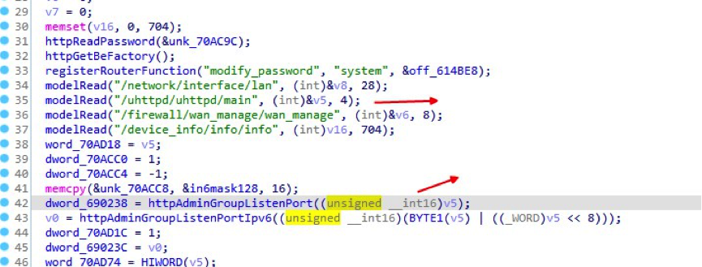
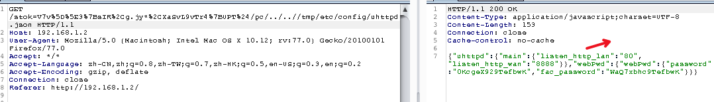
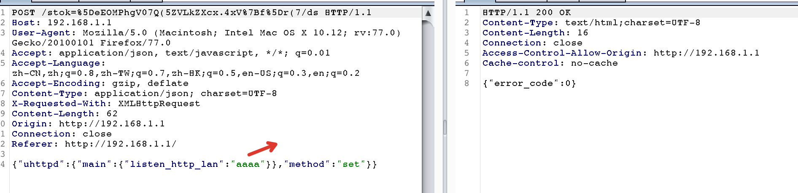
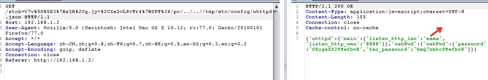

## Background

X18G is the latest wifi6 router from MERCUSYS Technologies, supports dual-band concurrent. Both 2.4GHz and 5GHz dual-band support the new generation Wi-Fi 6 protocol, with a wireless rate of up to 1775Mbps; it also supports 1024QAM Modulation technology, compared with Wi-Fi 5 (802.11ac) 256QAM modulation technology, can transmit more data per unit time, and the rate is significantly improved.

## Description

The Mercury X18g router provides the uhttpd set interface, which does not validate the listen_http_lan variable. An attacker can set the listen_http_lan variable to an unconventional character, which causes the web server to be unable to monitor the port effectively, and ultimately leads to a denial of service attack

## Affect Versions

Device: X18G

Firmware version: 1.0.5

## POC

When httpserver is initialized, the configuration of the relevant lan and wan listening ports will be read from uhttpd.json as follows:

Through exploit another vulnerability CVE-2021-23241, we can see that the initialization in uhttpd.json is as follows:

Through firmware extraction and reverse analysis, it is found that the listen_http_lan parameter can be set in the post of json, but this method cannot actually be triggered from the webserver

Check the configuration file again and find that listen_http_lan has become "aaaa", which is not a legal port param

When the device is powered off and restarted, the device cannot access the webserver , and the device needs to be reset before it can be used

## Acknowledgements
reporter:  Lewei QuDong and xiang Ke

## References
https://www.mercusys.com/en/

https://www.mercurycom.com.cn/product-521-1.html
