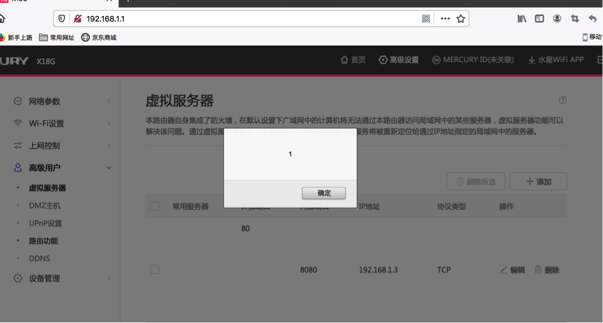
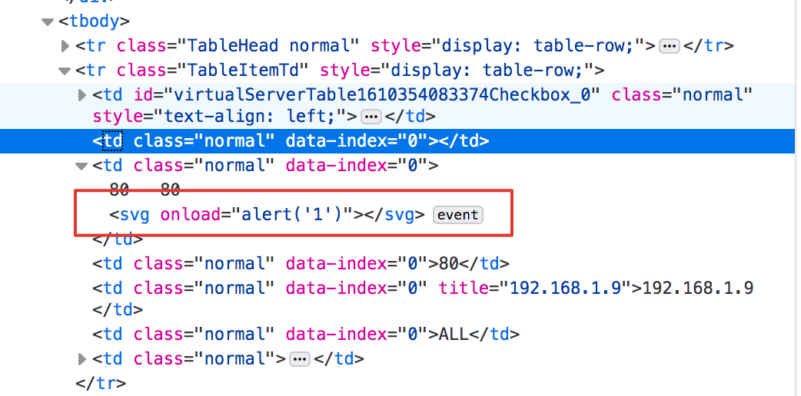

## Background

X18G is the latest wifi6 router from MERCUSYS Technologies, supports dual-band concurrent. Both 2.4GHz and 5GHz dual-band support the new generation Wi-Fi 6 protocol, with a wireless rate of up to 1775Mbps; it also supports 1024QAM Modulation technology, compared with Wi-Fi 5 (802.11ac) 256QAM modulation technology, can transmit more data per unit time, and the rate is significantly improved.

## Description

The virtual server setting module of X18G param src_dport_start、src_dport_end、dest_port does not effectively filter when output to the page which could cause a Stored Cross Site Scripting（XSS）.An attacker can exploit it to obtain sensitive information

## Affect Versions

Device: X18G

Firmware version: 1.0.5

## POC
The xss injection to src_port_start is as follows:

The result is as follows:

The final output to the page is as follows:

## Acknowledgements
reporter:  Lewei Qu and Dongxiang Ke

## References
https://www.mercusys.com/en/

https://www.mercurycom.com.cn/product-521-1.html
